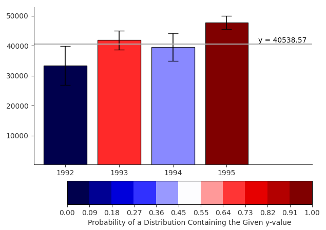

# Interactive Bar Chart

An implementation of an interactive bar chart with error bars as described in Ferreira et.al (2014). Users can click within the plot to select a y-value to compare against the probability distributions represented by the error bars. A line is drawn at the given y, and bars are coloured based on the probability that its distribution is larger than that value. The colour scale goes from dark blue (distribution is definitely below y-value), to white (y-value is the mean of the distribution), to dark red (distribution is definitely above y-value).

Ferreira, N., Fisher, D., & Konig, A. C. (2014, April). [Sample-oriented task-driven visualizations: allowing users to make better, more confident decisions](https://www2.cs.arizona.edu/~nivanferreira/pdfs/Ferreira_Fisher_Sample_Oriented_Tasks.pdf). In Proceedings of the SIGCHI Conference on Human Factors in Computing Systems (pp. 571-580). ACM 